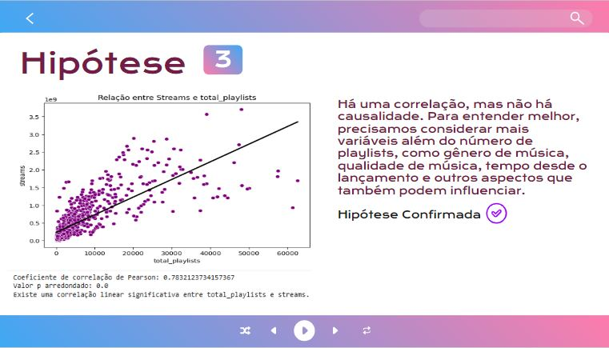
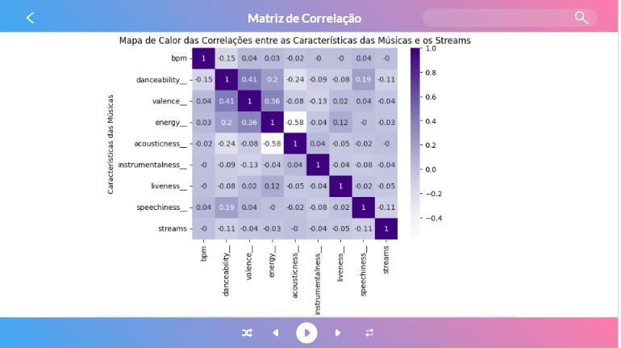

# Projeto Hipóteses
 
## Objetivo

Em um mundo onde a indústria musical é extremamente competitiva e em constante evolução, a capacidade de tomar decisões baseadas em dados tornou-se um ativo inestimável.

Nesse contexto, uma gravadora enfrenta o emocionante desafio de lançar um novo artista no cenário musical global. Felizmente, ela conta com uma poderosa ferramenta em seu arsenal: um extenso conjunto de dados do Spotify com informações sobre as músicas mais ouvidas em 2023.

- A gravadora levantou uma série de hipóteses sobre o que faz uma música seja mais ouvida. Essas hipóteses incluem:
- Músicas com BPM (Batidas Por Minuto) mais altos fazem mais sucesso em termos de número de streams no Spotify.
- As músicas mais populares no ranking do Spotify também possuem um comportamento semelhante em outras plataformas, como a Deezer.
- A presença de uma música em um maior número de playlists está correlacionada com um maior número de streams.
- Artistas com um maior número de músicas no Spotify têm mais streams.
- As características da música influenciam o sucesso em termos de número de streams no Spotify.

Você deve validar (refutar ou confirmar) essas hipóteses através da análise de dados e fornecer recomendações estratégicas com base em suas descobertas. O objetivo principal desta análise é que a gravadora e o novo artista possam tomar decisões informadas que aumentem suas chances de alcançar o “sucesso”.

## Equipe
Trabalho desenvolvido com Larysse Freire

## - **Ferramentas e Tecnologias**
    
- BigQuery
- Google Colab
- Python
- Power BI
- Google Slide

## Linguagens 

- SQL
- Python

## O desenvolvimento do projeto foi realizado através das seguintes fases:

- Processar e preparar os dados com consultas em SQL.
- Fazer uma análise exploratória (AED).
- Aplicar técnicas de análise como:
- Segmentação de categorias.
- Correlação de variáveis.
- Teste de significância através do teste de Wilcoxon.
- Regressão linear.
- Construção de dashboard.
- Apresentação de resultados para os stakeholders.
- Arquivos adicionais:

## Consultas SQL no Google Cloud. Disponíveis em: 
https://console.cloud.google.com/bigquery?ws=!1m4!1m3!3m2!1shipoteses-projeto2!2sprojeto2&pli=1&project=projeto2hipoteses-420119&supportedpurview=project

